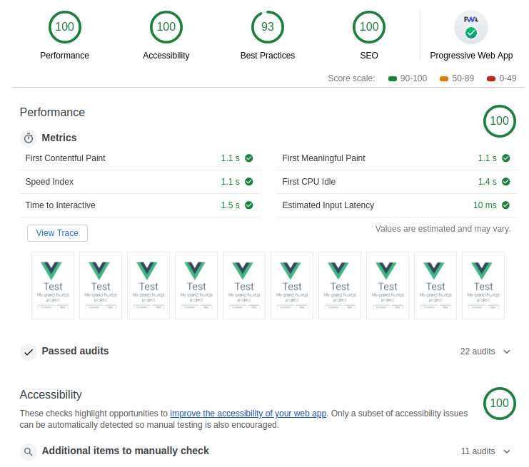

# nuxtjs-project-structure
Yet another practice to structure nuxt.js project
<p align="center">
  
</p>

## Build Setup

``` bash
# install dependencies
$ yarn install

# serve with hot reload at localhost:3000
$ yarn run dev

# build for production and launch server
$ yarn run build
$ yarn start

# generate static project
$ yarn run generate
```

For detailed explanation on how things work, checkout [Nuxt.js docs](https://nuxtjs.org).


# Create valid certificate to localhost
> **Warning**: Do not share any output file from this step to anyone And do not track them via version control tool.

```shell
# Remember password when created, And add rootCA.key to browser
$ openssl genrsa -des3 -out rootCA.key 2048

$ openssl req -x509 -new -nodes -key rootCA.key -sha256 -days 1024 -out rootCA.pem

$ openssl req -new -sha256 -nodes -out server.csr -newkey rsa:2048 -keyout nginx.key

# For v3.ext see below
$ openssl x509 -req -in server.csr -CA rootCA.pem -CAkey rootCA.key -CAcreateserial -out nginx.crt -days 500 -sha256 -extfile v3.ext
```

## v3.ext
```
authorityKeyIdentifier=keyid,issuer
basicConstraints=CA:FALSE
keyUsage = digitalSignature, nonRepudiation, keyEncipherment, dataEncipherment
subjectAltName = @alt_names

[alt_names]
DNS.1 = localhost
```

then copy `nginx.crt` and `nginx.key` to `config/cert` 

# Benchmark
```
$ wrk -c1000 -t2 -d30s http://localhost
Running 30s test @ http://localhost
  2 threads and 1000 connections
  Thread Stats   Avg      Stdev     Max   +/- Stdev
    Latency   201.31ms  265.44ms   1.35s    81.34%
    Req/Sec     7.39k     3.29k   14.26k    74.32%
  264362 requests in 30.09s, 91.27MB read
  Socket errors: connect 47, read 0, write 0, timeout 0
Requests/sec:   8786.12
Transfer/sec:      3.03MB
```

# Know issue
 1. highest score in best practice is 93 because request of `manifest.json` use http1.1 
